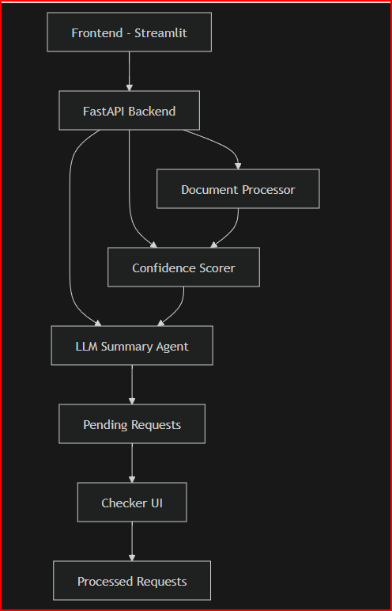

# AI Name Change Verification System

## Overview
AI-assisted system for verifying legal name change requests using document extraction, fuzzy matching, confidence scoring, and LLM reasoning.

---

## Features
- Document upload (DOCX)
- Name extraction
- Fuzzy matching (RapidFuzz)
- Confidence scoring
- LLM-based explanation
- Human-in-the-loop workflow
- Pending → Processed system

---

## Architecture

## 🚀 How to Run

### 1. Clone the repo
git clone https://github.com/susheel557/Assessment-Agivant.git
cd Assessment-Agivant

### 2. Install dependencies
pip install -r requirements.txt

### 3. Set environment variable
export GROQ_API_KEY=your_key_here   # Mac/Linux
set GROQ_API_KEY=your_key_here      # Windows

### 4. Run backend
uvicorn backend.main:app --reload

### 5. Run frontend (Streamlit)
streamlit run frontend/app.py

## 🔄 Demo Flow

1. User submits:
   - Customer ID
   - Old Name
   - New Name
   - Uploads document

2. System:
   - Extracts names from document
   - Performs fuzzy matching
   - Calculates confidence score
   - Runs LLM for explanation

3. Request moves to:
   - Pending (AI Verified)

4. Human reviewer:
   - Approves / Rejects

5. Final status:
   - Approved / Rejected (stored in processed)

## ⚠️ Limitations

- Uses basic text extraction (no real OCR yet)
- Forgery detection is simulated
- In-memory storage (no persistent DB)
- Single change type (Name Change only)
- Not production scalable (prototype only)
## 🧠 Future Improvements

- Integrate OCR (Textract / Tesseract)
- Add real fraud detection models
- Use LangGraph for agent orchestration
- Add PostgreSQL for persistence
- Deploy using Docker + Kubernetes